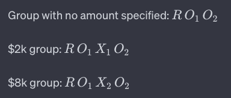

### Encouraging employees to contribute $2k or $8k to their retirement
- Here we want to see **the effect of over-asking** on the employees' contribution to their retirement.
- The intervention is to **ask the employees to contribute $2k or $8k** to their retirement.

#### Most likely design for the experiment

- Just like the A/B test done on some websites, we can randomly show the employees the none, $2k or $8k contribution option.

**Why we want to prepare the group without $amount specified?**
- serves as a baseline to understand the natural contribution behavior without any suggested amounts.
- we can see the effect of "anchoring" gets stronger or weaker when we suggest a specific and/or larger amount.

#### Threats to validity

**Internal Validity**

- if the employees from different groups communicate with each other, one could be influenced by the other. For example, if the employees from the $2k group talk to the employees from the $8k group, then the employees from the $2k group might be influenced by the employees from the $8k group and contribute more to their retirement.
- if some employees are aware of the study, they could change their behavior.

**External Validity**
- it might just be that the employees from this company have sufficient income to contribute to the effect of "anchoring". The effect of intervention could be smaller or larger for employees from other companies.
- if there is an economic event that affects the employees' contribution to their retirement, then the result of the experiment will not be generalizable to other times and companies.